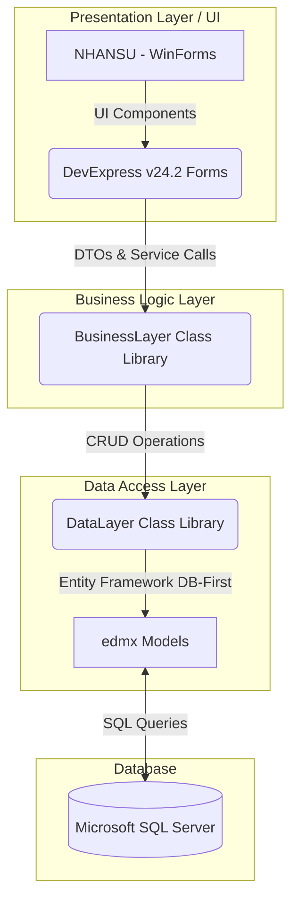
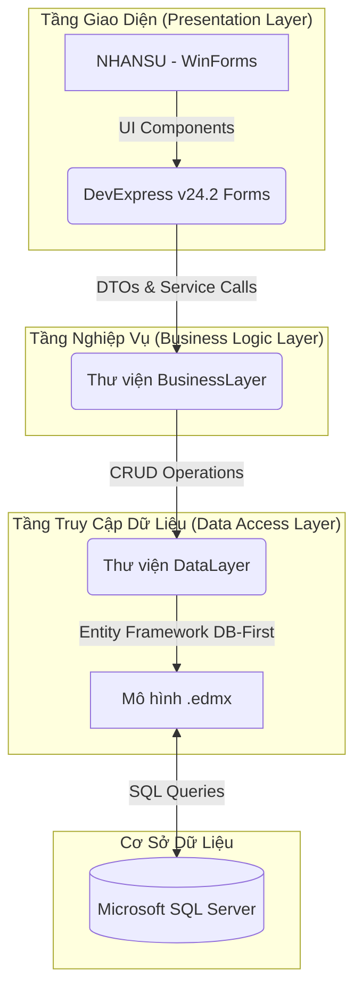

  <h1>🏢 Human Resources & Employee Information Management System</h1>
  <h3>Enterprise HR Operations - Desktop Application</h3>

  

    
    
    
    
    
    
  

  

    <i>[Tiếng Việt bên dưới / Vietnamese version below]</i>
  

<h2>🇺🇸 English Version</h2>

### 1. Overview
This project is a comprehensive desktop-based **Human Resources and Employee Information Management System (Quản lý Nhân sự)**. Designed to streamline enterprise HR operations, the system provides a robust suite of tools for businesses to manage their organizational structure, employee records, labor contracts, timekeeping, payroll processing, and various human resource procedures (such as transfers, promotions, and resignations).

The application is built using **C#** and **WinForms** on the **.NET Framework 4.7.2**, featuring a rich, modern, and highly intuitive Ribbon-based user interface powered by **DevExpress v24.2** controls. The data persistence layer is handled by **Entity Framework** (Database First) communicating with a **Microsoft SQL Server** database.

### 2. Objectives & Key Features
The main goal of the system is to digitize and automate daily HR tasks, ensuring data consistency, reducing manual paperwork, and facilitating quick decision-making. 

Key features include:
- 🔐 **Authentication & Security:** Secure user login system with role-based access control to protect sensitive HR and payroll data.
- 🏢 **Organizational Management:** Dynamically manage companies, branches (units), departments, and job roles.
- 👥 **Employee Records:** Detailed tracking of personal information, qualifications, ethnicity, religion, contact details, and current employment status.
- 📝 **HR Processes Lifecycle:** Full lifecycle management including Labor Contracts issuance, Rewards and Disciplinary actions, Internal Department/Role Transfers, Salary Increases (Promotions), and Employee Resignations.
- 🕒 **Timekeeping & Attendance:** Manage monthly timesheets, daily work shifts, types of attendance, and detailed daily timekeeping records (chấm công) for each employee.
- 💰 **Payroll Management:** Handle salary advances, complex overtime calculations, insurance deductions, and end-of-month salary processing.
- 📊 **Reporting & Exporting:** Generate and print high-quality labor contracts, monthly payslips, and comprehensive HR reports using DevExpress XtraReports.

### 3. System Architecture
The application is structured using a standard **3-Tier Architecture** to separate concerns, improve maintainability, and ensure scalability:

**Layers Breakdown:**
1. **Presentation Layer (`NHANSU`):** Contains the Windows Forms user interfaces (e.g., `MainForm`, `frmNhanVien`, `frmHopDongLaoDong`). Heavily relies on DevExpress UI components like Ribbon Control, XtraGrid for data tables, and XtraReports.
2. **Business Logic Layer (`BusinessLayer`):** Encapsulates the core business rules and workflows. Acts as an intermediary between the UI and the database.
3. **Data Access Layer (`DataLayer`):** Utilizes Entity Framework to manage database connections and execute transactions securely.

### 4. Database Schema Structure
The SQL Server database is well-structured into distinct modular tables:

| Module | Core Tables | Description |
| :--- | :--- | :--- |
| **System & Auth** | `tb_User` | Stores application user credentials and roles. |
| **Dictionaries** | `tb_CONGTY`, `tp_BOPHAN`, `tb_PHONGBAN`, `tb_CHUCVU` | Organizational structure categories. |
| **Demographics** | `tb_TRINHDO`, `tb_DANTOC`, `tb_TONGIAO` | Qualification, Ethnicity, and Religion lists. |
| **Core Employee** | `tb_NHANVIEN` | Central entity table storing employee demographic and status data. |
| **HR Operations** | `tb_HOPDONG`, `tb_KHENTHUONG_KYLUAT`, `tb_NHANVIEN_DIEUCHUYEN`, `tb_NHANVIEN_NANGLUONG`, `tb_NHANVIEN_THOIVIEC` | Historical records of all HR events (contracts, promotions, discipline). |
| **Timekeeping** | `tb_KYCONG`, `tb_KYCONGCHITIET`, `tb_BANGCONG`, `tb_LOAICA`, `tb_LOAICONG` | Configuration and detail logs for attendance. |
| **Payroll & Finance** | `tb_TANGCA`, `tb_UNGLUONG`, `tb_BAOHIEM` | Tables managing financial parameters affecting monthly payroll. |

### 5. Getting Started
1. **Prerequisites:**
   - Microsoft Visual Studio 2022 (or 2019) installed with .NET Desktop Development workload.
   - DevExpress Universal v24.2 (or a compatible version).
   - Microsoft SQL Server Management Studio (SSMS).
2. **Database Setup:** 
   - Open SSMS and execute the `QLNHANSU.sql` script to create the database schema and populate initial reference data.
3. **Configuration:** 
   - Open `QUANLYNHANSU.sln` in Visual Studio.
   - Update the connection string in the `App.config` file of the UI project (`NHANSU`) and `DataLayer` to point to your local SQL Server instance.
4. **Run:** Set `NHANSU` as the Startup Project and hit **Start** (F5) to run the application. Default login credentials can be found in the `tb_User` table.

### 6. Authors & Acknowledgments
- **Team Members (2 members):** 
  - Pham Nguyen Phuc An
  - Nguyen Quang Binh
- **Instructor:** MSc. Luong Tran Hy Hien

---

<h2>🇻🇳 Tiếng Việt</h2>

### 1. Tổng quan
Dự án này là một hệ thống ứng dụng Desktop **Quản lý Nhân sự (Human Resources and Employee Information Management System)** toàn diện. Được thiết kế nhằm tối ưu hóa và số hóa các hoạt động nhân sự trong doanh nghiệp, hệ thống cung cấp bộ công cụ mạnh mẽ để quản lý cơ cấu tổ chức, hồ sơ nhân viên, hợp đồng lao động, chấm công, tính lương và các quy trình nhân sự khác (như điều chuyển, nâng lương, thôi việc).

Ứng dụng được xây dựng bằng ngôn ngữ **C#** và **WinForms** trên nền tảng **.NET Framework 4.7.2**, nổi bật với giao diện người dùng hiện đại, trực quan dạng Ribbon nhờ sử dụng bộ thư viện **DevExpress v24.2**. Tầng giao tiếp và lưu trữ dữ liệu được quản lý bởi **Entity Framework** (Database First) kết nối với hệ quản trị cơ sở dữ liệu **Microsoft SQL Server**.

### 2. Mục tiêu & Tính năng chính
Mục tiêu cốt lõi của hệ thống là tự động hóa các tác vụ nhân sự hàng ngày, đảm bảo tính đồng nhất của dữ liệu, giảm thiểu giấy tờ thủ công và hỗ trợ quản lý đưa ra quyết định nhanh chóng.

Các tính năng nổi bật bao gồm:
- 🔐 **Bảo mật & Phân quyền:** Hệ thống đăng nhập an toàn, bảo vệ các dữ liệu nhạy cảm về hồ sơ nhân sự và lương thưởng.
- 🏢 **Quản lý Cơ cấu Tổ chức:** Quản lý linh hoạt danh mục Công ty, Chi nhánh/Bộ phận, Phòng ban và Chức vụ.
- 👥 **Quản lý Hồ sơ Nhân viên:** Lưu trữ chi tiết thông tin cá nhân, trình độ học vấn, dân tộc, tôn giáo, thông tin liên lạc và trạng thái làm việc hiện tại.
- 📝 **Nghiệp vụ Nhân sự:** Quản lý trọn đời vòng lặp nhân sự bao gồm: Phát hành Hợp đồng lao động, Khen thưởng & Kỷ luật, Điều chuyển công tác (thay đổi phòng ban/chức vụ), Nâng lương và Xử lý thôi việc.
- 🕒 **Chấm công & Điểm danh:** Quản lý kỳ công, bảng công tháng, cấu hình ca làm việc, loại hình chấm công và chi tiết chấm công từng ngày cho mỗi nhân viên.
- 💰 **Quản lý Tiền lương:** Xử lý các khoản ứng lương, tính toán tăng ca (làm thêm giờ), các khoản trừ bảo hiểm và tổng hợp bảng lương cuối tháng.
- 📊 **Báo cáo & Kết xuất:** Tự động tạo và in ấn Hợp đồng lao động, Phiếu lương và các Báo cáo nhân sự chuyên nghiệp sử dụng DevExpress XtraReports.

### 3. Kiến trúc hệ thống
Ứng dụng được thiết kế theo mô hình **Kiến trúc 3 lớp (3-Tier Architecture)** chuẩn mực để phân tách logic, dễ dàng bảo trì và mở rộng:

**Chi tiết các lớp:**
1. **Tầng Giao Diện (`NHANSU`):** Chứa các form người dùng (ví dụ: `MainForm`, `frmNhanVien`, `frmHopDongLaoDong`). Sử dụng tối đa sức mạnh của DevExpress UI như Ribbon Control, XtraGrid để hiển thị bảng dữ liệu, và XtraReports cho tính năng in ấn.
2. **Tầng Nghiệp Vụ (`BusinessLayer`):** Đóng gói các quy tắc nghiệp vụ cốt lõi. Đóng vai trò cầu nối xử lý dữ liệu giữa giao diện và tầng cơ sở dữ liệu.
3. **Tầng Truy Cập Dữ Liệu (`DataLayer`):** Sử dụng Entity Framework để quản lý kết nối và thực thi các giao dịch cơ sở dữ liệu một cách an toàn.

### 4. Cấu trúc Cơ sở dữ liệu
Cơ sở dữ liệu SQL Server được thiết kế phân hệ rõ ràng, bám sát các module chức năng:

| Phân hệ | Các Bảng Chính | Mô tả |
| :--- | :--- | :--- |
| **Hệ thống & Phân quyền** | `tb_User` | Lưu trữ tài khoản đăng nhập. |
| **Danh mục Tổ chức** | `tb_CONGTY`, `tp_BOPHAN`, `tb_PHONGBAN`, `tb_CHUCVU` | Các danh mục định nghĩa sơ đồ tổ chức công ty. |
| **Danh mục Thông tin** | `tb_TRINHDO`, `tb_DANTOC`, `tb_TONGIAO` | Các danh mục dùng chung (Trình độ, Dân tộc, Tôn giáo). |
| **Nhân viên Cốt lõi** | `tb_NHANVIEN` | Bảng trung tâm lưu trữ thông tin cơ bản và trạng thái của nhân viên. |
| **Nghiệp vụ Nhân sự** | `tb_HOPDONG`, `tb_KHENTHUONG_KYLUAT`, `tb_NHANVIEN_DIEUCHUYEN`, `tb_NHANVIEN_NANGLUONG`, `tb_NHANVIEN_THOIVIEC` | Lưu trữ lịch sử các sự kiện, biến động nhân sự. |
| **Chấm công** | `tb_KYCONG`, `tb_KYCONGCHITIET`, `tb_BANGCONG`, `tb_LOAICA`, `tb_LOAICONG` | Cấu hình kỳ công và lưu trữ chi tiết công làm việc thực tế. |
| **Tiền lương & Tài chính** | `tb_TANGCA`, `tb_UNGLUONG`, `tb_BAOHIEM` | Quản lý các thông số tài chính tác động đến quá trình tính lương tháng. |

### 5. Hướng dẫn cài đặt
1. **Yêu cầu hệ thống:**
   - Microsoft Visual Studio 2022 (hoặc 2019) có cài đặt môi trường .NET Desktop Development.
   - DevExpress Universal v24.2 (hoặc phiên bản tương thích).
   - Hệ quản trị cơ sở dữ liệu Microsoft SQL Server & SQL Server Management Studio (SSMS).
2. **Khởi tạo Database:** 
   - Mở SSMS và chạy file script `QLNHANSU.sql` được đính kèm để tự động tạo cấu trúc các bảng và dữ liệu mẫu (nếu có).
3. **Cấu hình ứng dụng:** 
   - Mở Solution `QUANLYNHANSU.sln` bằng Visual Studio.
   - Mở file `App.config` ở dự án giao diện (`NHANSU`) và cập nhật lại chuỗi kết nối (`Connection String`) sao cho trỏ đúng vào server SQL Server tại máy của bạn (Server Name & Authentication).
4. **Chạy ứng dụng:** Đặt project `NHANSU` làm **Startup Project** và nhấn **Start** (F5) để khởi chạy phần mềm. Tài khoản đăng nhập mặc định có thể tra cứu trong bảng `tb_User`.

### 6. Tác giả & Lời cảm ơn
- **Nhóm tác giả (2 thành viên):** 
  - Phạm Nguyễn Phúc Ân
  - Nguyễn Quang Bình
- **Giảng viên hướng dẫn:** ThS. Lương Trần Hy Hiến

